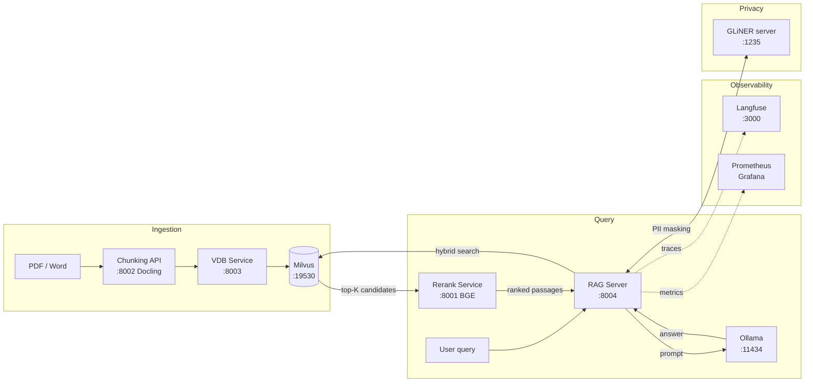

# RAG Platform — FastAPI microservices with Milvus hybrid search and BGE reranking

Production-grade Retrieval-Augmented Generation system built as independent FastAPI microservices: document chunking via Docling, hybrid vector search (BM25 + dense HNSW) in Milvus, BGE cross-encoder reranking, LLM generation via Ollama, Langfuse observability, GLiNER PII anonymization, and Prometheus/Grafana monitoring.


---

## Architecture



### Service ports

| Service | File | Port |
|---|---|---|
| Rerank (BGE) | `src/rerank_server/rerank_service.py` | 8001 |
| Chunking API (Docling) | `src/ingestor_server/ingestor_service/app_chunks.py` | 8002 |
| VDB Service (Milvus) | `src/ingestor_server/vdb_service/app_vdb_milvus.py` | 8003 |
| RAG Server | `src/rag_server/rag_service_telemetry.py` | 8004 |
| GLiNER PII server | `src/rag_server/gliner_server/server.py` | 1235 |
| Ollama | — | 11434 |
| Milvus | — | 19530 |
| Embedding TEI | — | 8083 |

### Docker Compose files (`deploy/compose/`)

| Compose file | Purpose |
|---|---|
| `docker-compose-milvus.yml` | Milvus + etcd + MinIO |
| `docker-compose-embedding.yaml` | TEI embedding service |
| `docker-compose-ingestor.yaml` | Chunking API + VDB service |
| `docker-compose-rag-server.yaml` | Rerank + RAG server |
| `monitoring/docker-compose.yaml` | Prometheus + Grafana + Zipkin + OTEL collector |

---

## Key features

- **Hybrid retrieval** — BM25 sparse + dense HNSW with Reciprocal Rank Fusion in Milvus
- **BGE reranking** — cross-encoder reranking with batched async inference on MPS/CPU
- **Docling chunking** — structure-aware (hybrid) and recursive strategies; tables preserved
- **Groundedness check** — LLM self-grounding with automatic regeneration on hallucination detection
- **Semantic cache** — Redis TTL cache on normalized query strings
- **Circuit breakers** — per-service (Milvus, reranker) with configurable thresholds
- **PII anonymization** — GLiNER NER masks emails, phone numbers, names before Langfuse traces
- **Observability** — OpenTelemetry traces → Zipkin, Prometheus metrics → Grafana dashboards

---

## Prerequisites

- Python 3.11
- Docker
- Ollama installed and running
- Hugging Face account (for model downloads)
- LibreOffice (optional — `.docx` ingestion via PDF conversion)

---

## Quick start

```bash
cp .env.example .env
# Edit .env: set MILVUS_COLLECTION name and adjust model names if needed

cd deploy/compose
docker compose -f docker-compose-milvus.yml up -d
docker compose -f docker-compose-ingestor.yaml up --build -d
docker compose -f docker-compose-rag-server.yaml up --build -d
```

---

## Deployment — step by step

### 1. Milvus (vector database)

```bash
cd deploy/compose
docker compose -f docker-compose-milvus.yml up -d
```

### 2. Embedding TEI

Download the embedding model before first run:

```bash
python -c "from huggingface_hub import snapshot_download; snapshot_download(repo_id='intfloat/multilingual-e5-base', local_dir='~/hf_models/multilingual-e5-base')"
```

```bash
docker compose -f docker-compose-embedding.yaml up -d
```

### 3. Langfuse (observability)

Clone Langfuse outside the project, then start it:

```bash
cd ~
git clone https://github.com/langfuse/langfuse.git
cd langfuse && docker compose up -d
```

### 4. Ingestor services (chunking + VDB)

```bash
docker compose -f docker-compose-ingestor.yaml up --build
```

### 5. RAG server (reranker + generation)

```bash
docker compose -f docker-compose-rag-server.yaml up --build
```

### 6. Monitoring (optional)

```bash
docker compose -f monitoring/docker-compose.yaml up -d
```

---

## Ollama models

```bash
ollama pull qwen2.5:7b
ollama pull qwen3-embedding:0.6b
```

---

## Docling models

```bash
docling-tools models download
```

---

## GLiNER PII server (optional)

Masks PII in Langfuse traces. If stopped, anonymization is silently skipped.

```bash
cd src/rag_server
python -m gliner_server.server
# Verify: curl http://localhost:1235/v1/extract
```

---

## Redis (semantic cache)

```bash
docker run -d --name redis-rag -p 6380:6379 redis
```

---

## Local development (without Docker)

```bash
python -m venv .venv && source .venv/bin/activate
pip install -r requirements.txt
```

Or with Poetry:
```bash
poetry install
```

Start services:
```bash
export KMP_DUPLICATE_LIB_OK=TRUE
uvicorn rerank_server.rerank_service:app --host 0.0.0.0 --port 8001
uvicorn ingestor_server.ingestor_service.app_chunks:app --host 0.0.0.0 --port 8002
uvicorn ingestor_server.vdb_service.app_vdb_milvus:app --host 0.0.0.0 --port 8003
uvicorn rag_server.rag_service_telemetry:app --host 0.0.0.0 --port 8004
```

---

## Ingestion (PDF/Word → chunks → Milvus upsert)

Place documents in a folder and run the ingestion script:

```bash
# Hybrid strategy (structure-aware, recommended for PDFs with tables)
python src/ingestor_server/ingestor_service/ingestor.py ./docs \
  --strategy hybrid --max-chars 1200

# Recursive strategy (paragraph-based)
python src/ingestor_server/ingestor_service/ingestor.py ./docs \
  --strategy recursive --batch-size 16
```

To download the sample ArXiv papers used during development:

```bash
bash scripts/download_sample_pdfs.sh
```

---

## LibreOffice (optional — `.docx` ingestion)

```bash
# macOS
brew install --cask libreoffice
# Linux
sudo apt update && sudo apt install -y libreoffice
```

---

## Configuration

Copy `.env.example` to `.env` and adjust values. Key variables:

| Variable | Default | Description |
|---|---|---|
| `MILVUS_COLLECTION` | `knowledge_base` | Collection name in Milvus |
| `EMBEDDING_MODEL_NAME` | `intfloat/multilingual-e5-base` | Dense embedding model |
| `OLLAMA_MODEL` | `qwen2.5:7b` | Generation LLM |
| `TOP_K_RECALL` | `60` | Candidates retrieved before reranking |
| `TOP_K_FINAL` | `5` | Passages passed to LLM after reranking |
| `BUILD_CONTEXT_MAX_CHARS` | `6000` | Max context size sent to LLM |
| `RERANK_MODEL` | `BAAI/bge-reranker-base` | BGE cross-encoder model |
| `MAX_PASSAGES` | `256` | Max passages the reranker accepts per request |
